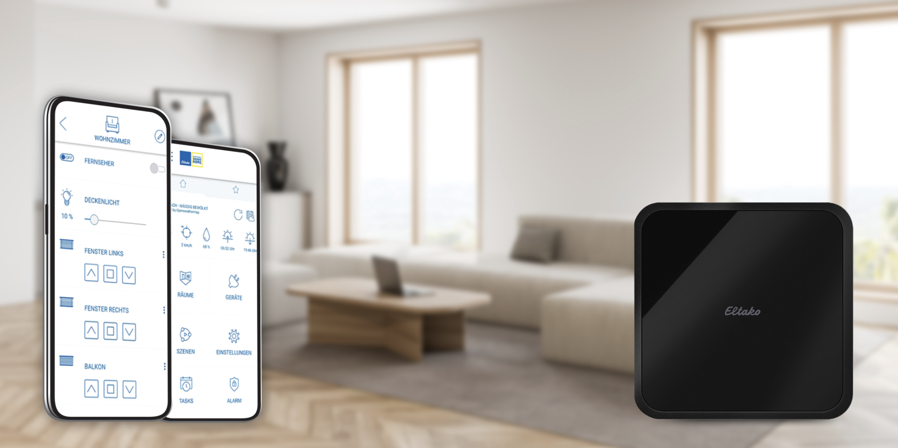

# Homebridge Eltako Plugin for MiniSafe2

This plugin adds the devices from your [Eltako MiniSafe2](https://www.eltako.com/en/product/professional-smart-home-en/controllers-and-gateways-enocean-zigbee-knx-dali-mqtt-and-much-more/minisafe2/) to Apple HomeKit.

 Image by [Eltako GmbH](https://www.eltako.com/)

# Requirements

If you have your home setup up and running in the [Eltako GFA5](https://apps.apple.com/app/eltako-gfa5/id1555852467) app and you want to control your devices with Apple HomeKit, this is the right plugin for you.

If you are not sure yet, here's what you need:
 - The devices you want to control need to be pre-teached
 - The devices you want to control need to be known to an [Eltako MiniSafe2](https://www.eltako.com/en/product/professional-smart-home-en/controllers-and-gateways-enocean-zigbee-knx-dali-mqtt-and-much-more/minisafe2/) in your local network.
   - The plugin needs its IP address and the password to access it.

If you don't have a MiniSafe2 in your network, this plugin won't be able to control any devices. Ask your electrician how to get a MiniSafe2 up and running in your environment.

# Supported devices

Right now, the following devices are supported:

 - Switches (shown as switch or light depending on the `target`)
 - Blinds

 I don't have any other devices to test. Donations welcome :)

# Limitations

 - The MiniSafe2 does not support change notifications, that's why values have to be polled regularly. Also, the MiniSafe2 does not allow to poll the state of specific devices but returns the state of every single device in your home. These polls can get really huge and take up to a few seconds, which leads to a small delay to recognize state changes from outside of HomeKit. The official GFA5 app is not faster, though.
 - Blinds will only report their absolute position once they stopped. They won't provide any target values or their current state (going up, going down, stopped).

 # Disclaimer

 This plugin brings inofficial HomeKit support for some Eltako devices. It is not affiliated with Eltako GmbH or any other person except myself.
 
 Everything this plugin is able to do was reverse engineered. This way, this plugin will never support 100% of the devices and commands. Any help finding API resources is highly welcome.
 
  I wrote this plugin for fun, use it at your own risk.